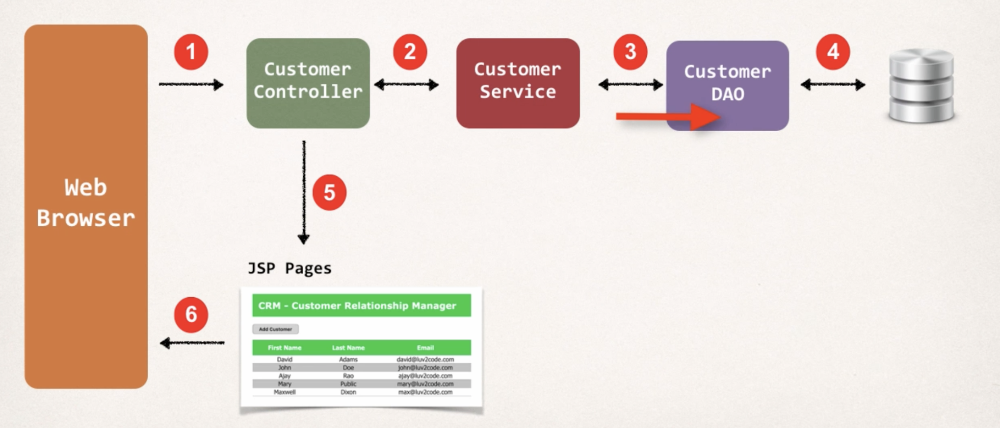
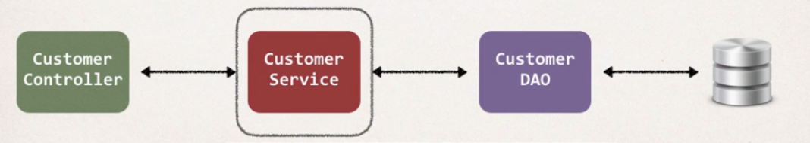

🏢 CRM Application with Spring MVC & Hibernate
This project is a Customer Relationship Management (CRM) application built with Spring MVC, Hibernate (JPA), and MySQL.
It demonstrates how to manage customer data using the MVC design pattern, a service layer, and DAO (Data Access Object) with Hibernate ORM.

✨ I have updated the dependencies so it works with Java 17 and managed libraries using Maven.

## Architecture (Big Picture)

## Service Layer

🚀 Features
View list of customers

Add a new customer

Update existing customer details

Delete a customer

🏗️ Architecture Overview
The project follows the MVC pattern with a Service Layer:

Controller Layer → Handles HTTP requests (CustomerController).

Service Layer → Contains business logic and manages transactions.

DAO Layer → Handles database operations using Hibernate.

Entity Layer → Maps Java classes to database tables.

View Layer (JSP) → Displays data to the user.

🔧 Technologies Used
Java 17

Spring MVC (for web layer)

Hibernate (Spring Data JPA) (for database mapping)

MySQL (database)

Maven (dependency management)

Tomcat (server)

JSP + JSTL (frontend views)

📂 Database Setup
Install MySQL.

Run the SQL scripts provided inside sql-scripts/:

01-create-user.sql → creates database user.

02-customer-tracker.sql → creates tables and sample data.

▶️ Running the Application
You can run the project in two ways:

Option 1: Using Maven Tomcat Plugin
From the project root folder (where pom.xml is located), run:

mvn clean install
mvn tomcat7:run
Then open: http://localhost:8080/web-customer-tracker

option 2
## How to run this application?

1. Install MySQL database

2. Run the database scripts to create a user and load sample data
   a. sql-scripts/01-create-user.sql
   b. sql-scripts/02-customer-tracker.sql

3. Open the source code for the appropriate version

4. Run the application: 
   a. Select the root project folder.
   b. Run based on your IDE .
📝 Notes
Logging is implemented using AOP (Aspect-Oriented Programming) for clean separation of concerns.

Transactions are managed at the service layer to allow multiple DAO operations inside a single transaction.

